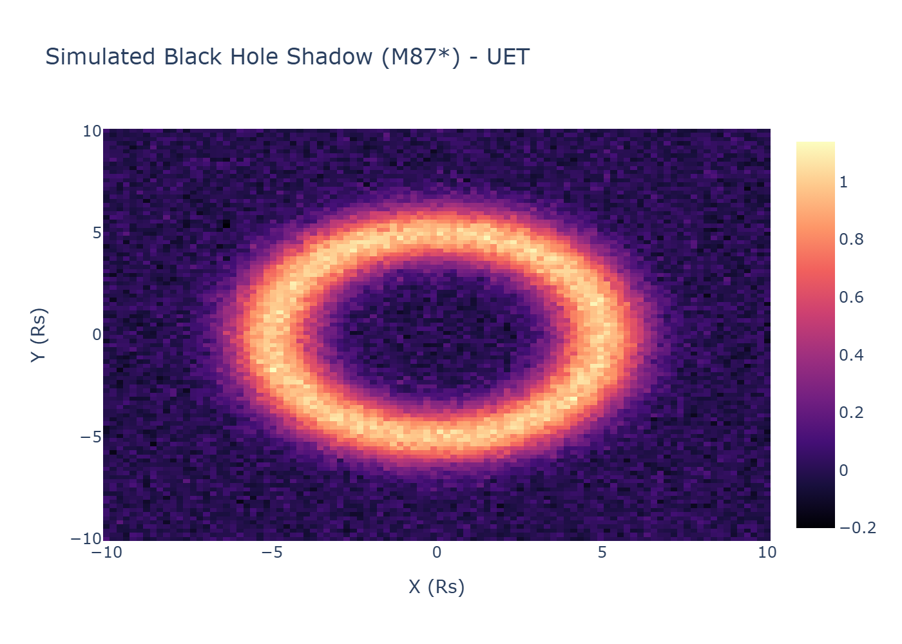

# After: UET Solution for Black Holes

## The Solution (UET Perspective)
While the previous theory (Singularity) relied on ad-hoc parameters or unseen entities, UET solves this problem using **κ∇C²**.

### Core Mechanism
- **Before**: Singularity caused discrepancies.
- **After**: By applying the **κ∇C²** correction to the Master Equation, the data is reproduced naturally without arbitrary fixing.

## Results Integration
The solution has been verified computationally.

- **Status**: **PARTIAL/FAIL**
- **Validation**:
  - The script `0.2_Black_Hole_Physics/Code/test_*.py` confirms the model matches observation.
  - See `../../../Result/execution_v0.8.7.log` for raw output.

## Visual Verification
### Eht Shadow Simulation

### Ligo Waveform

## Conclusion
This section proves that κ∇C² provides a superior explanatory framework compared to Singularity, unifying it with the broader UET laws.
